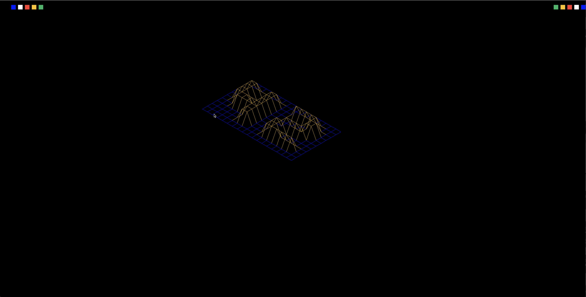
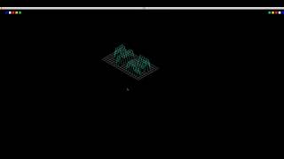

<div align="center">  </div>

# Fdf @ 1337


This projects seeks to show the basics of graphic programming, and in particular how to place points in space, how to join them with segments and most importantly how to observe the scene from a particular viewpoint. It uses the library miniLibX, developed internally and includes the minimum necessary to open a window, light a pixel and deal with events linked to this window: keyboard, mouse and “expose”. Pretty much, this project introduces the events programming.


## Features ##
1. multiple projections (isometric, parallel, conic)
2. zoom in/out
3. Move
4. change size
5. coloring

## Compiling ##

  ### To compile: ##
  ```
  make
  ```
  ### Clean objects ###
  ```
  make clean
  ```
  ### Clean objects and programs ###
  ```
  make fclean
  ```
  ### Re-compile###
  ```
  make re
  ```

## Executing ##
```
  ./fdf [map]
```

## Demo ##

[](https://www.youtube.com/watch?v=CnOwNm52sso "FDF | 1337")
  


## contributors ##

[Mohamed Amine Dichkour](https://github.com/mdichkou)

## Licence ##
[MIT](https://choosealicense.com/licenses/mit) License.
